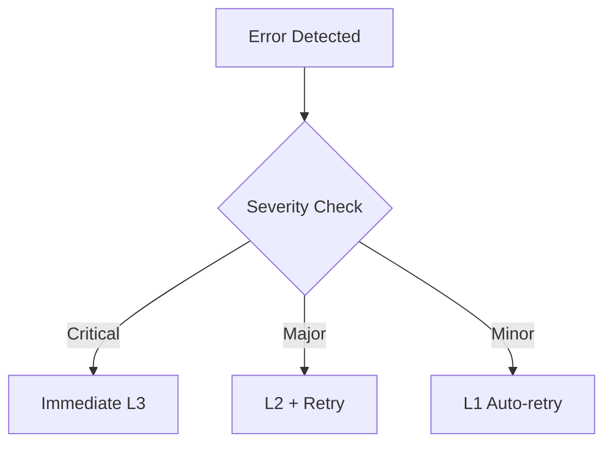

# Premium Meds Email Strategy Plan

## 1. Marketing Automation Workflows

### Customer Journey Mapping

#### Stages
1. **Awareness**
   - Welcome sequence
   - Educational content
   - Brand introduction

2. **Consideration**
   - Product information
   - Comparison guides
   - Expert testimonials

3. **Purchase**
   - Order confirmation
   - Payment processing
   - Shipping updates

4. **Retention**
   - Follow-up care
   - Refill reminders
   - Feedback requests

### Triggered Email Sequences

#### Welcome Series
```
Trigger: New subscription
Sequence:
1. Welcome email (Immediate)
2. Educational content (Day 2)
3. Product guide (Day 4)
4. Special offer (Day 7)
```

#### Order Processing
```
Trigger: Purchase
Sequence:
1. Order confirmation (Immediate)
2. Shipping notification (When shipped)
3. Delivery confirmation (Post-delivery)
4. Feedback request (7 days after delivery)
```

#### Refill Reminder
```
Trigger: 7 days before predicted refill date
Sequence:
1. Initial reminder
2. 3-day reminder
3. Last day reminder
4. Follow-up if no action
```

### Reporting Requirements

Each workflow step requires:
- Delivery status
- Open rate
- Click-through rate
- Conversion rate
- Engagement time
- Response actions

## 2. Technical Implementation

### Gmail API Integration

#### Authentication
```javascript
{
  "type": "service_account",
  "auth_uri": "https://accounts.google.com/o/oauth2/auth",
  "token_uri": "https://oauth2.googleapis.com/token",
  "scopes": [
    "https://www.googleapis.com/auth/gmail.send",
    "https://www.googleapis.com/auth/gmail.modify",
    "https://www.googleapis.com/auth/gmail.labels"
  ]
}
```

#### Core API Endpoints
- `gmail.users.messages.send`
- `gmail.users.messages.get`
- `gmail.users.threads.list`
- `gmail.users.labels.create`

### Logging and Reporting

#### Log Structure
```json
{
  "event_id": "uuid",
  "timestamp": "2026-02-27 01:43:22 PST",
  "action": "SEND_EMAIL",
  "status": "SUCCESS",
  "details": {
    "message_id": "xyz123",
    "recipient": "user@example.com",
    "template": "welcome_001",
    "delivery_status": "delivered"
  }
}
```

### Error Handling

#### Error Levels
1. **Critical** - Immediate notification + pause operations
2. **Major** - Notification + retry with backoff
3. **Minor** - Log and monitor for patterns

#### Retry Strategy
```python
retry_config = {
    "max_attempts": 3,
    "initial_delay": 1000,  # ms
    "max_delay": 8000,      # ms
    "backoff_multiplier": 2
}
```

## 3. Mandatory Reporting Framework

### Real-time Chat Notifications

#### Format
```
📧 Gmail Action Report
Action: Send Welcome Email
Status: ✅ Success
Time: 01:43 PM PST
Details:
- Template: WELCOME_001
- Recipient: j***@example.com
- Message ID: WLC_123456
```

#### Required Fields
- Action Type
- Operation Status
- Timestamp (12-hour PST)
- Message Details
- Error Info (if applicable)

### Standardized Report Types

1. **Email Delivery Report**
```
Type: DELIVERY_STATUS
Fields:
- Message ID
- Delivery Status
- Timestamp
- Bounce Info (if applicable)
```

2. **User Action Report**
```
Type: USER_INTERACTION
Fields:
- Action Type (open/click/reply)
- User ID
- Timestamp
- Link Clicked (if applicable)
```

### Failure Handling

#### Escalation Levels
1. **L1** - Automated retry
2. **L2** - System admin notification
3. **L3** - Emergency contact alert

#### Escalation Flow


## 4. Email Operations Guidelines

### Standard Operating Procedures

#### Email Sending
1. Verify recipient permissions
2. Check sending quota
3. Apply template
4. Add tracking parameters
5. Queue for delivery
6. Log attempt
7. Report status

#### Template Management
1. Version control all templates
2. Mandatory review process
3. A/B testing protocol
4. Performance tracking

### Permission Controls

#### Access Levels
```
Level 1: View Only
Level 2: Send Only
Level 3: Template Edit
Level 4: Full Admin
```

#### Required Permissions
```yaml
send_email:
  required_level: 2
  requires_2fa: true
  audit_log: true

edit_template:
  required_level: 3
  requires_approval: true
  version_control: true
```

### Compliance Requirements

1. **Data Protection**
   - Encryption at rest
   - TLS for transmission
   - PII handling protocols

2. **Privacy Compliance**
   - Unsubscribe mechanism
   - Data retention policies
   - Consent tracking

3. **Healthcare Regulations**
   - PHI protection
   - HIPAA compliance
   - Secure communication

### Quality Control

#### Pre-send Checklist
- [ ] Template validation
- [ ] Personalization check
- [ ] Link verification
- [ ] Spam score analysis
- [ ] Mobile rendering test

#### Post-send Analysis
- [ ] Delivery rate check
- [ ] Engagement metrics
- [ ] Error report review
- [ ] Performance comparison

## 5. Monitoring and Analytics

### Key Performance Indicators

#### Delivery Metrics
- Delivery Rate
- Bounce Rate
- Spam Complaints
- Block Rate

#### Engagement Metrics
- Open Rate
- Click Rate
- Reply Rate
- Unsubscribe Rate

#### Business Metrics
- Conversion Rate
- Revenue Per Email
- List Growth Rate
- Customer Lifetime Value

### Performance Reporting

#### Daily Reports
```
Time: 9:00 AM PST
Contents:
- 24h Delivery Stats
- Engagement Summary
- Error Report
- Action Items
```

#### Weekly Analysis
```
Time: Monday 10:00 AM PST
Contents:
- Weekly Trends
- Performance vs. Targets
- Issue Resolution Summary
- Next Week Projections
```

### Deliverability Monitoring

#### Technical Checks
- SPF Records
- DKIM Signing
- DMARC Policy
- IP Reputation

#### Content Monitoring
- Spam Score
- Content Analysis
- Link Reputation
- Attachment Scanning

### Engagement Tracking

#### User-level Metrics
```json
{
  "user_id": "12345",
  "metrics": {
    "open_rate": 0.68,
    "click_rate": 0.23,
    "response_rate": 0.15,
    "average_engagement_time": "45s"
  }
}
```

#### Campaign Metrics
```json
{
  "campaign_id": "SPRING_2026",
  "metrics": {
    "total_sent": 10000,
    "unique_opens": 3200,
    "unique_clicks": 890,
    "conversions": 124,
    "revenue": 15600
  }
}
```

---

**Note**: This email strategy requires continuous monitoring and adjustment based on performance data and changing business needs. All Gmail API interactions will be reported in real-time to the designated chat channel following the specified format, ensuring complete transparency and accountability in email operations.