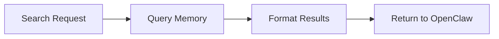

# Obsidian-OpenClaw Integration Guide

## Table of Contents
1. [Initial Setup](#initial-setup)
2. [Plugin Configuration](#plugin-configuration)
3. [File Structure](#file-structure)
4. [CustomJS and Advanced URI Setup](#customjs-and-advanced-uri-setup)
5. [n8n Workflow Automation](#n8n-workflow-automation)
6. [Common Pitfalls](#common-pitfalls)
7. [Recommended Plugins](#recommended-plugins)

## Initial Setup

### 1. Basic Obsidian Setup
1. Download and install Obsidian from https://obsidian.md
2. Create a new vault dedicated to OpenClaw integration
3. Enable Community Plugins in Settings → Community plugins
4. Install required core plugins:
   - File explorer
   - Templates
   - Daily notes
   - Calendar
   - Outgoing Links

### 2. OpenClaw Integration Prerequisites
1. Create a `.openclaw` folder in your vault root
2. Set up the following folder structure:
   ```
   .openclaw/
   ├── config/
   ├── memory/
   └── templates/
   ```
3. Configure vault settings:
   - Enable "Automatically update internal links"
   - Set default location for new notes to `.openclaw/memory`

## Plugin Configuration

### Essential Plugins for Automation
1. **Templater**
   - Install from Community Plugins
   - Set template folder to `.openclaw/templates`
   - Enable trigger on new file creation
   - Configure user scripts folder

2. **DataView**
   - Enable JavaScript queries
   - Set up index for `.openclaw/memory`
   - Configure inline fields

3. **Advanced URI**
   - Enable external triggers
   - Set up allowed commands
   - Configure security settings

4. **CustomJS**
   - Create `.openclaw/config/scripts` folder
   - Set up environment variables
   - Configure integration endpoints

## File Structure

### Recommended Organization
```
vault/
├── .openclaw/
│   ├── config/
│   │   ├── scripts/
│   │   └── settings.json
│   ├── memory/
│   │   ├── daily/
│   │   ├── permanent/
│   │   └── index.md
│   └── templates/
│       ├── daily.md
│       └── memory.md
├── projects/
└── workspace/
```

### Memory System Integration
1. **Daily Notes**
   - Template: `.openclaw/templates/daily.md`
   - Location: `.openclaw/memory/daily`
   - Naming format: `YYYY-MM-DD.md`

2. **Permanent Notes**
   - Location: `.openclaw/memory/permanent`
   - Linked to daily notes
   - Indexed for quick access

## CustomJS and Advanced URI Setup

### CustomJS Configuration
```javascript
// .openclaw/config/scripts/openclaw.js

class OpenClawIntegration {
    constructor() {
        this.memoryPath = '.openclaw/memory';
        this.configPath = '.openclaw/config';
    }

    async createMemoryEntry(content) {
        // Implementation
    }

    async searchMemory(query) {
        // Implementation
    }

    // Additional integration methods
}
```

### Advanced URI Setup
1. Configure URI schemes:
   ```
   obsidian://openclaw/memory/create
   obsidian://openclaw/memory/search
   obsidian://openclaw/action/execute
   ```

2. Security considerations:
   - Whitelist allowed commands
   - Validate input parameters
   - Log all external triggers

## n8n Workflow Automation

### Basic Setup
1. Install n8n
2. Configure Obsidian webhook node
3. Set up authentication

### Example Workflows

1. **Memory Creation Flow**


2. **Search and Retrieve Flow**


## Common Pitfalls

1. **Memory Management**
   - ❌ Storing sensitive data in plain text
   - ❌ Missing daily note templates
   - ✅ Use encryption for sensitive data
   - ✅ Implement proper backup systems

2. **Integration Issues**
   - ❌ Hardcoded paths in scripts
   - ❌ Unsecured URI endpoints
   - ✅ Use relative paths and environment variables
   - ✅ Implement proper authentication

3. **Workflow Problems**
   - ❌ Complex automation without error handling
   - ❌ Direct file system access
   - ✅ Implement proper error handling
   - ✅ Use Obsidian API for file operations

## Recommended Plugins

### Core Automation
1. Templater
2. DataView
3. Advanced URI
4. CustomJS
5. Periodic Notes

### Enhanced Functionality
1. Calendar
2. Natural Language Dates
3. Text Expander
4. QuickAdd

### Development Tools
1. Script Kitchen
2. Dev Tools
3. MetaEdit

## Best Practices

1. **Version Control**
   - Use git for tracking changes
   - Exclude sensitive data
   - Regular backups

2. **Security**
   - Encrypt sensitive information
   - Use environment variables
   - Regular security audits

3. **Performance**
   - Optimize JavaScript code
   - Use caching when possible
   - Regular maintenance

## Maintenance

### Daily Tasks
1. Backup memory files
2. Check integration logs
3. Update indexes

### Weekly Tasks
1. Clean up temporary files
2. Update plugins
3. Review automation workflows

---

*Note: This guide is maintained as part of the OpenClaw documentation. For updates and community contributions, please refer to the official OpenClaw repository.*