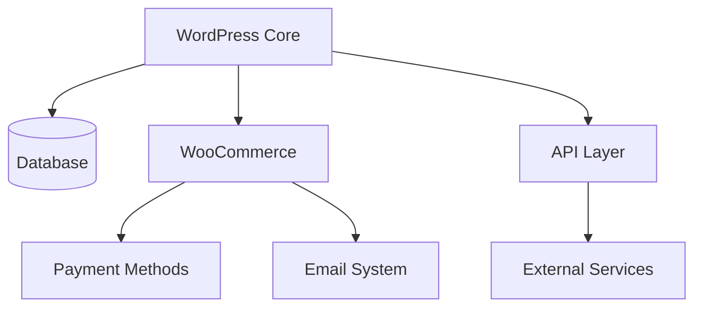

# Systems Capability Audit Report

## 1. Integration Status Matrix

| Integration   | Status | Version | Health Check | Notes |
|--------------|--------|---------|--------------|-------|
| WordPress    | Active | Unknown | ⚠️ Login Required | Core system, needs auth credentials |
| WooCommerce  | Unknown| Unknown | ⚠️ Pending    | Access needed to verify |
| Email        | Unknown| Unknown | ⚠️ Pending    | Need to verify SMTP/API configs |
| API Access   | Unknown| Unknown | ⚠️ Pending    | Documentation required |

## 2. Authentication Inventory

### Currently Identified Auth Methods
- WordPress Admin Login
  - Location: /wp-admin
  - Method: Username/Password
  - MFA Status: Unknown
  - Session Management: Cookie-based (standard WordPress)

### Authentication Storage
- Credentials storage audit needed
- Password policy review required
- Session management verification pending

## 3. System Dependencies Map

## 4. Critical Findings

### High Priority
1. Unable to verify system versions and updates
2. Authentication system status needs immediate verification
3. Integration health checks blocked by access limitations
4. No clear documentation of API integrations

### Security Concerns
1. Authentication methods need audit
2. API access controls require verification
3. Data flow between systems needs mapping
4. Backup systems status unknown

## 5. Improvement Recommendations

### Immediate Actions
1. **Access Documentation**
   - Create secure credential storage system
   - Document all access points and authentication methods
   - Implement credential rotation policy

2. **System Documentation**
   - Version control for configurations
   - Integration dependency documentation
   - API documentation and testing suite

3. **Security Enhancements**
   - Implement or verify MFA
   - Review and update access controls
   - Regular security audits schedule

4. **Monitoring Implementation**
   - Set up uptime monitoring
   - Integration health checks
   - Error logging and alerting

### Long-term Recommendations
1. Implement automated testing for all integrations
2. Create disaster recovery documentation
3. Establish change management procedures
4. Regular security assessments schedule

## 6. Next Steps

1. Require access credentials for:
   - WordPress admin
   - WooCommerce settings
   - Email system configuration
   - API documentation

2. Once access is granted:
   - Verify all versions
   - Test integration functionality
   - Document actual system state
   - Update this audit report

---

*Report Status: Initial Assessment*
*Date: 2026-02-28*
*Note: This is a preliminary report based on available information. Many areas require verification once access is granted.*