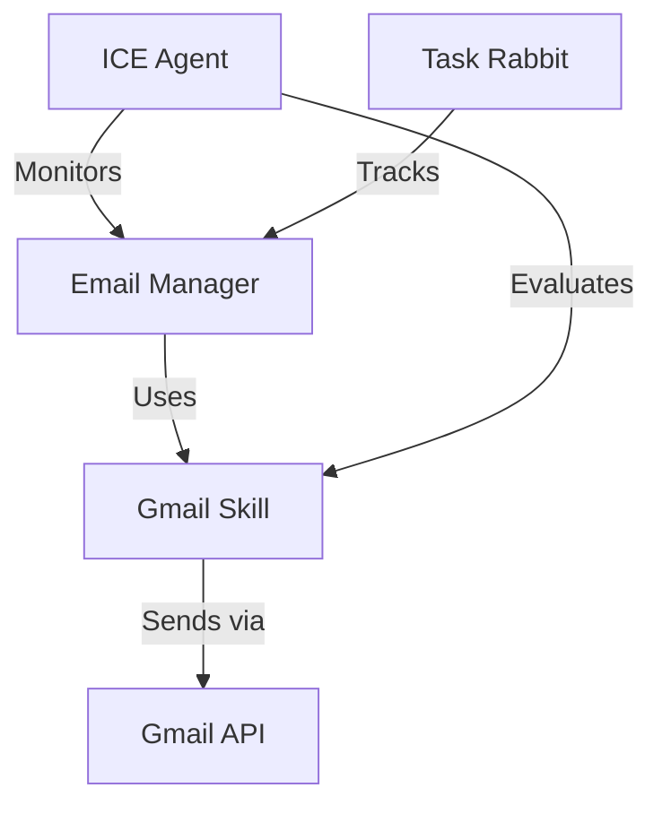

# Email System Integration

## Overview
Integration between Email-Manager Agent and Gmail Skill for Premium Meds email operations.

## Core Components
1. **Gmail Skill**
   - Path: `~/.nvm/versions/node/v24.13.1/lib/node_modules/openclaw/skills/gmail/`
   - Primary Account: premiummedscollective@gmail.com
   - Secondary Recipients: bweldy82@gmail.com

2. **Email Manager Agent**
   - Path: `~/.openclaw/agents/email-manager/`
   - Config: [[email-manager-config]]
   - Protocols: [[email-manager-protocols]]

3. **Documentation**
   - Integration Guide: [[GMAIL_INTEGRATION]]
   - Templates: `gmail/templates/*.txt`

## Communication Flow


## Verification
- Test Send Date: 2024-03-04
- Test Messages:
  - ID: 19cb793e86ea767d (to Premium Meds)
  - ID: 19cb796230347d6a (to bweldy82)
- Status: ✅ Verified Working

## ICE Agent Integration
ICE maintains oversight of:
- Email delivery status
- System performance
- Integration health
- Security compliance

## Usage Examples

### Sending Email
```bash
cd ~/.nvm/versions/node/v24.13.1/lib/node_modules/openclaw/skills/gmail && ./scripts/gmail.py send \
  --to "recipient@email.com" \
  --template "template_name"
```

### Checking Status
```bash
cd ~/.nvm/versions/node/v24.13.1/lib/node_modules/openclaw/skills/gmail && ./scripts/gmail.py check \
  --labels "UNREAD"
```

## Templates
Located in: `~/.nvm/versions/node/v24.13.1/lib/node_modules/openclaw/skills/gmail/templates/`

Currently includes:
- agents_list.txt
- progress_report.txt
- campaign_update.txt
- analytics_report.txt
- delivery_status.txt

## Monitoring
ICE Agent monitors:
1. Delivery success rates
2. Response times
3. Queue status
4. Error rates
5. Template performance

## Related Notes
- [[email-system-architecture]]
- [[monitoring-protocols]]
- [[ice-agent-oversight]]